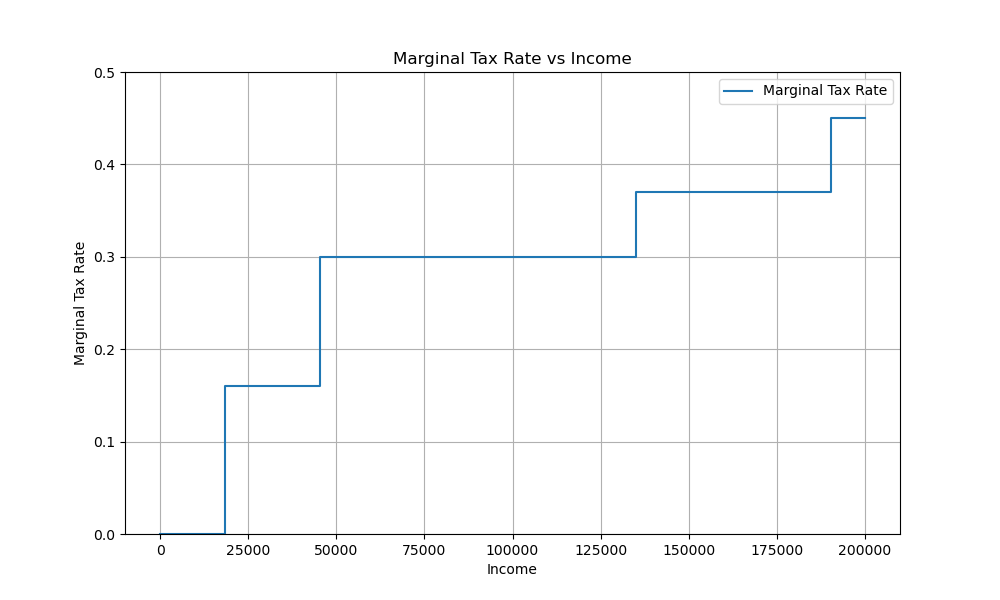
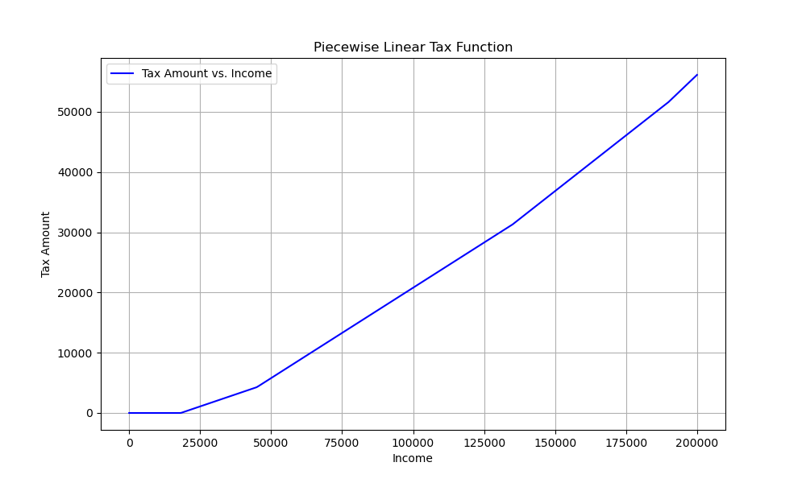
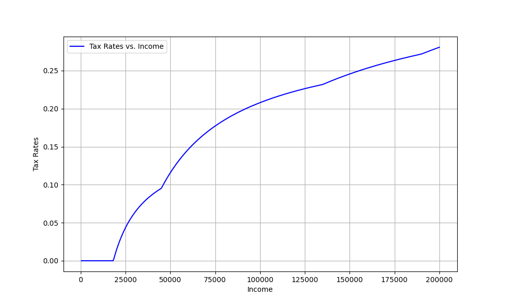
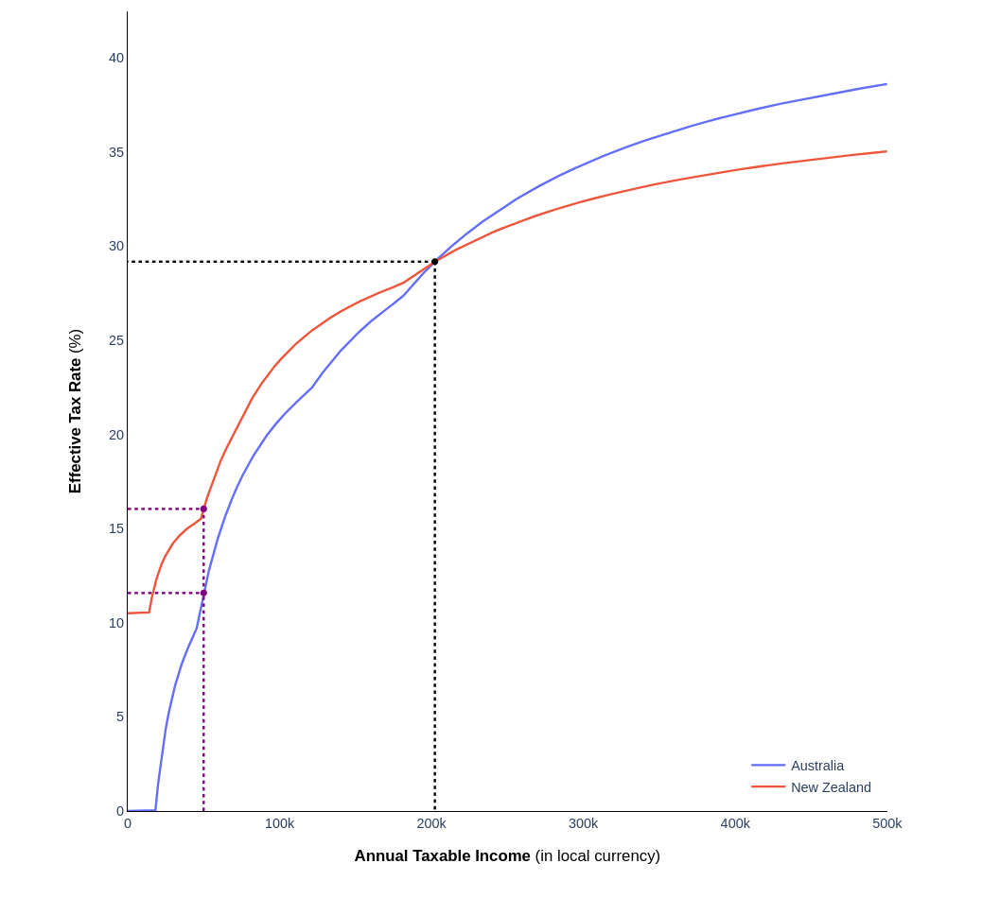
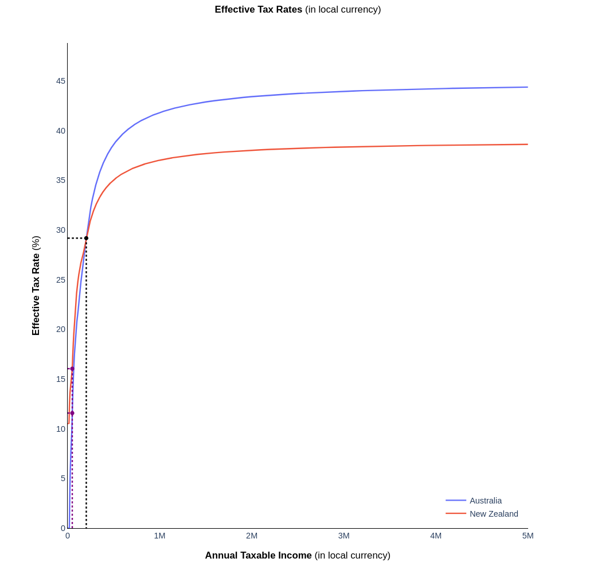

# Compare effective tax rates between countries

### Frontend: 

Will be implemented in React + Typescript + Plotly because V1 did a lot of this work already.

1) A "Select countries" dropdown
2) A "Income" input box
3) A "Maximum income to consider" input box
4) A "Show breakeven points" input box
5) Function to render plot. Reduce payload size over the wire.
6) A normalising currency. Default is the locale of the client.
7) Needs to look good enough.

### Backend:

Example payload to send to backend
```json
{
  "countries": ["New Zealand", "Australia"],
  "income": 50000.0,
  "max_income": 200000.0,
  "show_break_even": true,
  "normalizing_currency": "NZD"
}
```

Example request:
```bash
curl -X POST http://127.0.0.1:8080/process \
     -H "Content-Type: application/json" \
     -d '{"countries":["New Zealand","Australia"],"income":50000.0,"max_income":200000.0,"show_break_even":true,"normalizing_currency":"NZD"}'
```


Example response:

```json
{
    "country_specific_data": {
        "Australia": {
            "Incomes": [
                ...
            ],
            "tax_amounts": [
                ...
            ],
            "effective_tax_rates": [
                ...
            ],
            "specific_tax_amount": 0,
            "specific_tax_rate": 0
        },
        "New Zealand": {
            "Incomes": [
                ...
            ],
            "tax_amounts": [
                ...
            ],
            "effective_tax_rates": [
                ...
            ],
            "specific_tax_amount": 0,
            "specific_tax_rate": 0
        },
    },
    "country_comb_data": {
        "New Zealand-Australia": {
            "breakeven_incomes": [
                ...
            ],
            "breakeven_tax_amounts": [
                ...
            ],
            "breakeven_effective_tax_rates": [
                ...
            ]
        }
    }
}

```


### Methodology (high level)


#### Marginal Tax Rates curves

We start with data that characterises marginal tax rates as a function of income. This feels like the most natural way to represent a progressive tax rate scheme. Storing the schemes in this way makes the configuration easy to maintain.

Example scheme:
```python
import matplotlib.pyplot as plt
import numpy as np
def marginal_tax_rate(income):
    if income <= 18200:
        return 0
    elif income <= 45000:
        return 0.16
    elif income <= 135000:
        return 0.30
    elif income <= 190000:
        return 0.37
    else:
        return 0.45
income_values = np.linspace(0, 200000, 500)
marginal_rates = [marginal_tax_rate(income) for income in income_values]
plt.figure(figsize=(10, 6))
plt.step(income_values, marginal_rates, where='post', label='Marginal Tax Rate')
plt.xlabel('Income')
plt.ylabel('Marginal Tax Rate')
plt.legend()
plt.grid(True)
plt.ylim(0, 0.5)
plt.show()
```



This scheme can be thought of as being characterised by several ordered knot points $(r, b)$ where $r$ is the marginal rate and $b$ is the upper limit to which that marginal rate applies to.

Given this scheme, the income tax amount $f(x; \vec{\mu})$ for a given level of income $x \in \mathbb{R}_{\geq 0}$ given a marginal tax scheme $\vec{\mu} = \{(r_1, b_1),(r_2, b_2),....(r_n, b_n)\}$ is given by:


$$ f(x ; \vec{\mu} ) = \sum_{i=1}^{n}(r_i - r_{i - 1})*max(0, x - b_{i - 1})$$

$$ r_0 = 0, b_0 = 0 \;\;\forall\vec{\mu}$$

This is a nice representation, but is inefficient when computing for a large number of values of $x$.

#### Peicewise Linear Income Tax Curves

Another representation of a tax scheme can be obtained - a piecewise linear form, characterised as points $(t, b)$ where $t$ is the tax amount and $b$ is the upper limit at which that tax amount corresponds to

Given this scheme, the income tax amount $g(x; \vec{\nu})$ where the knot points $\vec{\nu} = \{(t_1,b_1),(t_2,b_2), ... (t_n, b_n)\}$ is given by:

$$f(x, \vec{\nu}) =
\begin{cases} 
b_1 & \text{if } x \leq t_1 \\
b_i + \frac{b_{i+1} - b_i}{t_{i+1} - t_i} \cdot (x - t_i) & \text{for } t_i < x \leq t_{i+1}, \text{ where } i = 1, 2, \ldots, n-1 \\
b_n & \text{if } x > t_n
\end{cases}
$$

$b_n$ should be set to a very large number (the actual scheme will be unbounded).

The piecewise linear representation allows for efficient computation of tax amounts for a large number of x values. Once the segment that an x value falls into is determined, the result can be computed in constant time with linear interpolation. This can be parallelised within each segment.

```python
import numpy as np
import matplotlib.pyplot as plt
def tax_amount(income):
    if income <= 18200:
        return 0
    elif income <= 45000:
        return 0.16 * (income - 18200)
    elif income <= 135000:
        base_tax = 0.16 * (45000 - 18200)
        return base_tax + 0.30 * (income - 45000)
    elif income <= 190000:
        base_tax = 0.16 * (45000 - 18200) + 0.30 * (135000 - 45000)
        return base_tax + 0.37 * (income - 135000)
    else:
        base_tax = 0.16 * (45000 - 18200) + 0.30 * (135000 - 45000) + 0.37 * (190000 - 135000)
        return base_tax + 0.45 * (income - 190000)
incomes = np.linspace(0, 200000, 500)
taxes = np.array([tax_amount(income) for income in incomes])
plt.figure(figsize=(10, 6))
plt.plot(incomes, taxes, label='Tax Amount vs. Income', color='blue')
plt.xlabel('Income')
plt.ylabel('Tax Amount')
plt.grid(True)
plt.legend()
plt.show()
```



#### Exchange rates considerations

When comparing tax rates, it is important to normalise the tax amounts into the same currency.

The exchange rate could be modelled as an r.v. and pointwise confidenece bands applied to the tax curves, but this is currently beyond the scope of V2. 

The r.v. would be a linear transformation to the income tax amounts, which would make the computation of confidence bands efficient, independent of the computational price of $f(x; \vec{\nu{}}) \;\; \forall x$.

For now, the scope of exchange rate considerations will be to simply adjust the income tax amount by the current day's exchange rate in order to have an apples to apples comparison.

#### Effective tax rates curves

Lastly, it is useful to have a view of the effective tax rates.

```python
# from previous code chunk
rates = taxes/incomes
plt.figure(figsize=(10, 6))
plt.plot(incomes, rates, label='Tax Rates vs. Income', color='blue')
plt.xlabel('Income')
plt.ylabel('Tax Rates')
plt.grid(True)
plt.legend()
plt.show()
```


#### Breakeven points

Finding breakeven points between two countries tax schemes is trivial in the peicewise linear representation. It becomes a problem of searching through overlapping segments and solving 2x2 linear systems for each overlapping segment. Conditioning the solve attempts only on segments that overlap in income ranges reduces the computational cost.

Specifically, results can be derived by setting two line segments to eachother:

$${\displaystyle L1=L2 \implies \{\mathbf {a_1} +t_1(\mathbf{b_1 - a_1}) \mid t_1\in [0,1]\} =\{\mathbf {a_2} +t_2(\mathbf{b_2 - a_2}) \mid t_2\in [0,1]\}}$$

This results in solving system in the form $A\vec{t} = \vec{r}$ and verifying that $\vec{t} \in [\vec{0}, \vec{1}]$.

#### Adaptive step size approaches

Of particular concern is the marginal rates curve. If it were not needed, then there would not be a need to discretise the curves using a step size at all (since the income tax vs income is piecewise linear it does not need step size, it is perfectly characterised by the knot points).

Despite the nonlinearities in the effective tax rates curves, at high values of income, the curve moves into steady state as successive effective tax rate values stabilise (the highest marginal tax rates begin to dominate assymptotically).


These images are from tax-compare V1 that shows how the behaviour stabilises.





It would be appropriate to look into an approach that uses an adaptive step size to account for the dynamics as $x \rightarrow \infty$ to be more computationally efficient.


#### References used (non-exhaustive): 
1. https://math.stackexchange.com/questions/3488993/intersection-of-2-piecewise-linear-curves

