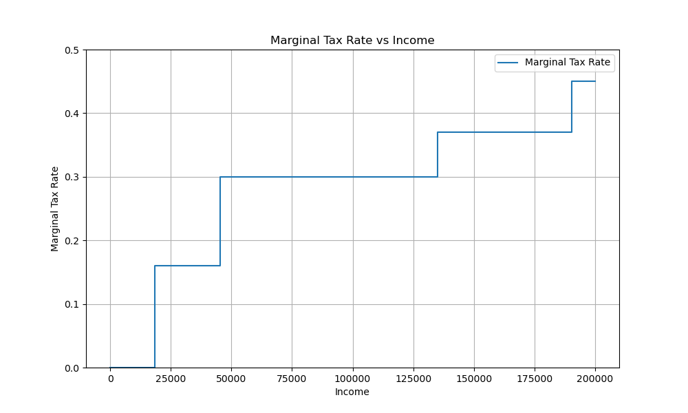
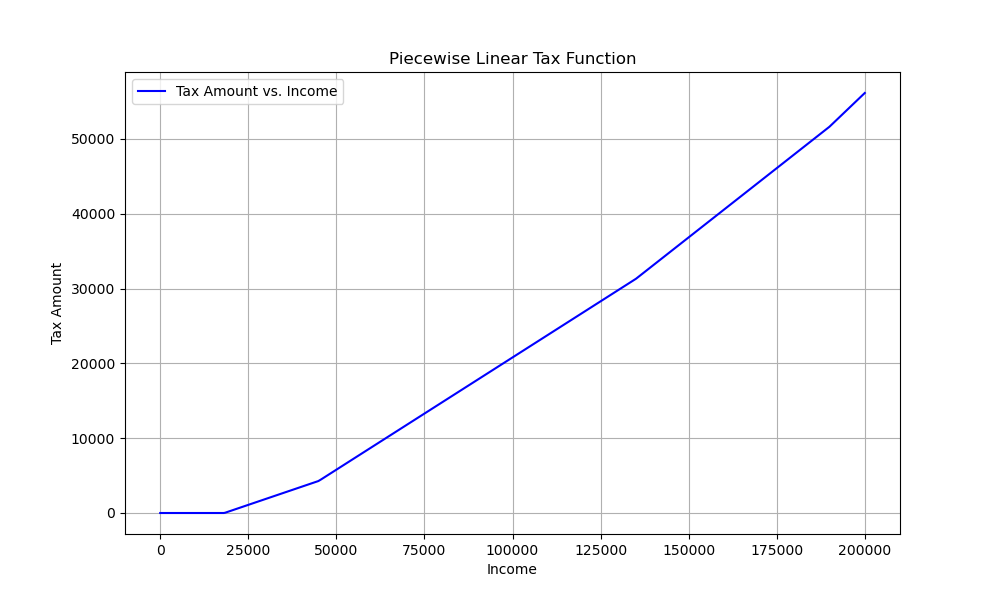
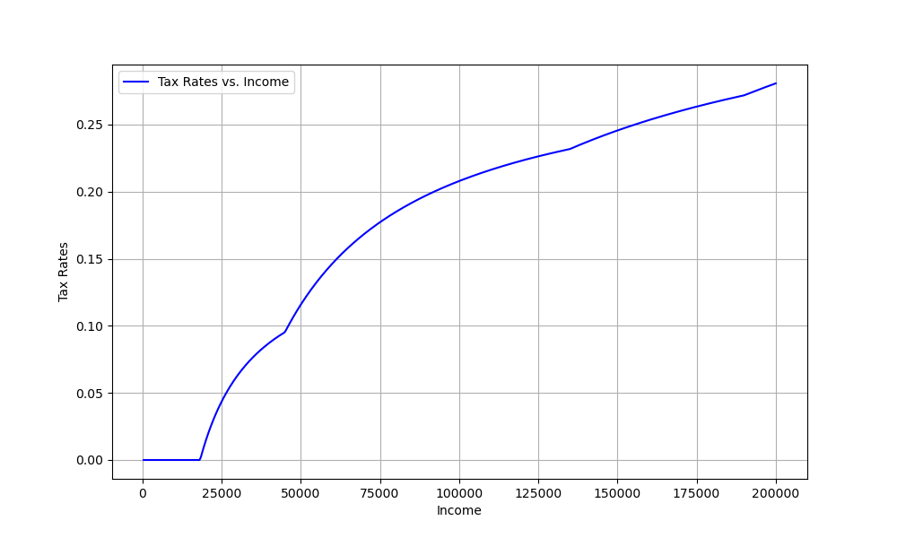
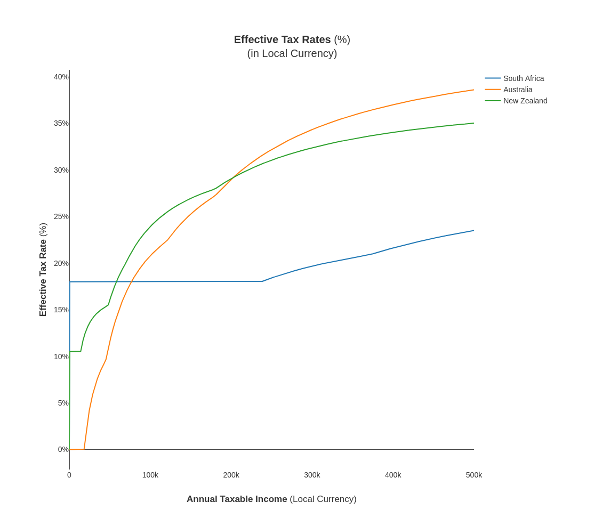
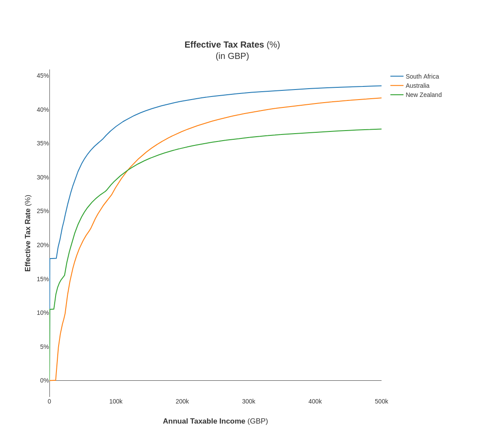
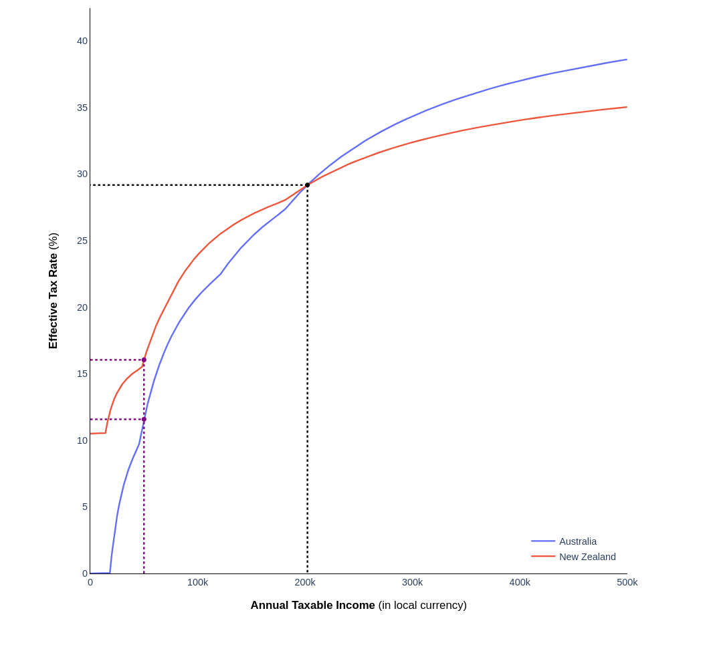
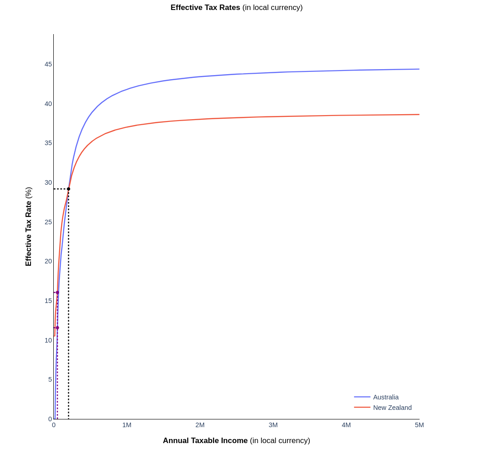

### Methodology (high level)

The easiest way to get a feel a country's taxation settings is to visualise the policy as a curve, not as a table of marginal rates. This document shows how to do that.

##### Parsing

1. Parsing [marginal tax rate schedules](#marginal-tax-rates-curves), adjusting for [exchange rates](#exchange-rates-considerations) if neccessary.
2. Transforming the [marginal tax rate schedules](#marginal-tax-rates-curves) into [tax amounts schedules](#peicewise-linear-income-tax-curves).

##### Computation

Once the [tax amount schedules](#peicewise-linear-income-tax-curves) are obtained, it becomes simple to:

1. Efficiently [compute the tax amounts](#peicewise-linear-income-tax-curves) for a given income, or for a range of incomes.
1. Efficiently [compute effective tax rates](#effective-tax-rates-curves) for a given income, or for a range of incomes.
3. Efficiently [compute breakeven points](#breakeven-points) for two or more different progressive tax rates schedules.
    

#### Marginal Tax Rates curves

We start with data that characterises marginal tax rates as a function of income. Storing the schemes in this way makes the configuration easy to maintain. Most countries represent their progressive tax schedules with marginal rates.

Example scheme:
```python
import matplotlib.pyplot as plt
import numpy as np
def marginal_tax_rate(income):
    if income <= 18200:
        return 0
    elif income <= 45000:
        return 0.16
    elif income <= 135000:
        return 0.30
    elif income <= 190000:
        return 0.37
    else:
        return 0.45
income_values = np.linspace(0, 200000, 500)
marginal_rates = [marginal_tax_rate(income) for income in income_values]
plt.figure(figsize=(10, 6))
plt.step(income_values, marginal_rates, where='post', label='Marginal Tax Rate')
plt.xlabel('Income')
plt.ylabel('Marginal Tax Rate')
plt.legend()
plt.grid(True)
plt.ylim(0, 0.5)
plt.show()
```



This scheme can be thought of as being characterised by a collection of ordered knot points $(b_i, t_i)$ where $r_i$ is the marginal rate and $b_i$ is the upper limit to which that marginal rate applies to.

The income tax amount $f(x; \vec{\mu})$ for a given level of income $x \in \mathbb{R}_{\geq 0}$ given a marginal tax scheme $\vec{\mu} = \{(b_1, r_1),(b_2, r_2),....(b_n, r_n)\}$ is given by:

$$ f(x ; \vec{\mu} ) = \sum_{i=1}^{n}(r_i - r_{i - 1})*max(0, x - b_{i - 1})$$

$$ r_0 = 0, b_0 = 0 \;\;\forall\vec{\mu}$$

Also note that $b_n$ will be unbounded i.e. $b_n = \infty$.

This is a nice representation, but we can use a more efficient representation if we want to compute a large number of values of $x$.

#### Peicewise Linear Income Tax Curves

Another representation of a tax schedule can be obtained, in piecewise linear form, characterised as points $(b_i, t_i)$ where $t_i$ is the tax amount and $b_i$ is the upper limit at which that tax amount corresponds to.

The income tax amount $g(x; \vec{\nu}, m)$ for a given level of income $x \in [0, m]$ given a tax amounts scheme $\vec{\nu} = \{(b_1,t_1),(b_2,t_2), ... (b_n, t_n)\}$ is computed by linear interpolation through the points $\{(b_{i-1}, t_{i-1}),(b_i, t_i)\}$ at $x$:

$$g(x; \vec{\nu}, m) =
b_{i-1} + \frac{b_{i} - b_{i-1}}{t_{i} - t_{i-1}} \cdot (x - t_{i-1}), \;\; t_{i-1} \leq x \leq t_{i}, \;\; i \in \{1, 2, \ldots, n \}
$$

$$ t_0 = 0, b_0 = 0 \;\;\forall\vec{\nu}$$

$$b_n = m \;\; \forall \vec{\nu}$$

Also note that in this representation, $b_n$ must be artificially bounded to some $m$ to make the interpolation of the final line segment possible.

This operation can be parallelised within each segment, and also between different segments.

```python
import numpy as np
import matplotlib.pyplot as plt
def tax_amount(income):
    if income <= 18200:
        return 0
    elif income <= 45000:
        return 0.16 * (income - 18200)
    elif income <= 135000:
        base_tax = 0.16 * (45000 - 18200)
        return base_tax + 0.30 * (income - 45000)
    elif income <= 190000:
        base_tax = 0.16 * (45000 - 18200) + 0.30 * (135000 - 45000)
        return base_tax + 0.37 * (income - 135000)
    else:
        base_tax = 0.16 * (45000 - 18200) + 0.30 * (135000 - 45000) + 0.37 * (190000 - 135000)
        return base_tax + 0.45 * (income - 190000)
incomes = np.linspace(0, 200000, 500)
taxes = np.array([tax_amount(income) for income in incomes])
plt.figure(figsize=(10, 6))
plt.plot(incomes, taxes, label='Tax Amount vs. Income', color='blue')
plt.xlabel('Income')
plt.ylabel('Tax Amount')
plt.grid(True)
plt.legend()
plt.show()
```



#### Effective tax rates curves

It is beneficial to have a view of the effective tax rates i.e. the actual tax rate paid. Once the [tax amount schedule](#peicewise-linear-income-tax-curves) is obtained, the computation is simple.

$$h(x, \vec{\nu}, m) = \frac{g(x, \vec{\nu}, m)}{x}$$

```python
# from previous code chunk
rates = taxes/incomes
plt.figure(figsize=(10, 6))
plt.plot(incomes, rates, label='Tax Rates vs. Income', color='blue')
plt.xlabel('Income')
plt.ylabel('Tax Rates')
plt.grid(True)
plt.legend()
plt.show()
```


#### Exchange rates considerations

When comparing tax rates, it is a good idea to normalise the tax amounts into the same currency.

This becomes particularly obvious when comparing South Africa's tax scheme against other countries due to the large exchange rate differences.


##### Demonstration of extreme exchange rate distortions (South Africa)





In this project, a single transformation of the tax schedule is applied, based on the most recent available exchange rates.

Future iterations of this project could model the exchange rate as a random variable. Confidence bands can be applied to the tax curves in order to form a more accurate view when comparing taxes across different countries.

#### Adaptive step sizing for large income values.

There is a need to discretise the income range using a step size. The only reason for this is that the effective tax rates curve is nonlinear (see [description](#effective-tax-rates-curves)).

Despite the nonlinearities in the effective tax rates curves, at high values of income, the curve moves into steady state, whereby successive effective tax rate values at each income step stabilise (i.e. the highest marginal tax rates begin to dominate assymptotically as a higher proportion of income lies in the final tax bracket).

Because of this structure, it is reasonable to use adaptive step sizing to exploit the converging behaviour $x \rightarrow \infty$ by increasing the step size dynamically.

Currently, the implementation uses a crude rule for changing the step size. For incomes $x_i$ the step size $x_{i-1} - x_{i} = \delta x_i$

$$
\Delta x = 
\begin{cases} 
\epsilon & \text{if } x_i < T \\ 
\Epsilon & \text{if } x_i \geq T 
\end{cases}
$$

$$\Epsilon > \epsilon$$

(Much better strategies exist, for example, estimating the curvature every nth point, and using a measure of curvature in the thresholding decision). This can be implemented in a future iteration.

##### Demonstration of assymptotic behaviour at different scales






#### Breakeven points

Finding breakeven points between two countries tax schemes is simple in the peicewise linear representation. It becomes a problem of searching through segments combinations and solving 2x2 linear systems for each potentially overlapping linear segment.

Specifically, results can be derived by setting two line segments to eachother:

$${\displaystyle L1=L2 \implies \{\mathbf {a_1} +t_1(\mathbf{b_1 - a_1}) \mid t_1\in [0,1]\} =\{\mathbf {a_2} +t_2(\mathbf{b_2 - a_2}) \mid t_2\in [0,1]\}}$$

This results in solving system in the form $A\vec{t} = \vec{r}$ and verifying that $\vec{t} \in [\vec{0}, \vec{1}]$.

Since it is cheap to check overlap in the income dimension, then [conditioning the solve attempts only on segments that overlap in income ranges reduces the computational cost](https://math.stackexchange.com/questions/3488993/intersection-of-2-piecewise-linear-curves).

